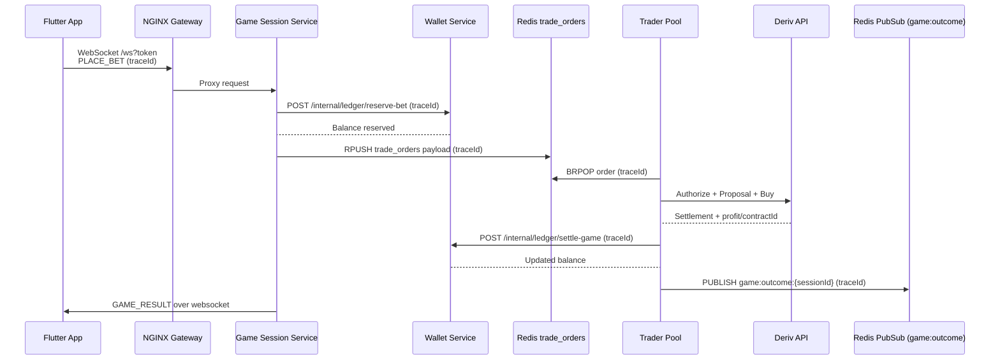
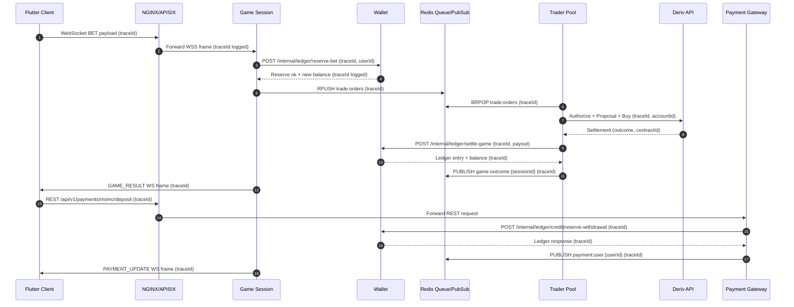

# Backend Architecture Specification
## Glory Grid Trading Platform

> **Version:** 1.2.0 | **Last Updated:** February 2026 | **Status:** Draft

---

## Table of Contents

1. [Executive Summary](#1-executive-summary)
2. [Goals & Non-Functional Requirements](#2-goals--non-functional-requirements)
3. [Tech Stack & Architectural Decisions (ADRs)](#3-tech-stack--architectural-decisions-adrs)
4. [High-Level Architecture Diagram](#4-high-level-architecture-diagram)
5. [Microservices Breakdown](#5-microservices-breakdown)
6. [Real-Time Game Engine Design](#6-real-time-game-engine-design)
7. [Deriv Account Load Balancing](#7-deriv-account-load-balancing)
8. [Payment Processing Pipeline](#8-payment-processing-pipeline)
   - [8.1 Crypto Payments (BTC, ETH, USDT)](#81-crypto-payments-btc-eth-usdt)
   - [8.2 Mobile Money (MoMo)](#82-mobile-money-momo)
9. [Data Architecture (MongoDB)](#9-data-architecture-mongodb)
10. [Security Architecture](#10-security-architecture)
    - [10.1 Authentication & Token Strategy](#101-authentication--token-strategy)
    - [10.2 Network Security](#102-network-security)
    - [10.3 Payment & Crypto Security](#103-payment--crypto-security)
    - [10.4 Application-Level Security](#104-application-level-security)
    - [10.5 Data Privacy & Compliance](#105-data-privacy--compliance)
    - [10.6 Operational Security (OpSec)](#106-operational-security-opsec)
    - [10.7 Security Threat Model](#107-security-threat-model)
11. [Observability & Monitoring](#11-observability--monitoring)
12. [Scalability Roadmap](#12-scalability-roadmap)
13. [Race Condition & Financial Risk Audit](#13-race-condition--financial-risk-audit)
    - [13.1 Balance Double-Spend Race](#131-balance-double-spend-race)
    - [13.2 Duplicate Payment Credit](#132-duplicate-payment-credit)
    - [13.3 Kafka At-Least-Once Delivery](#133-kafka-at-least-once-delivery)
    - [13.4 Deriv Trader Pool Deadlock](#134-deriv-trader-pool-deadlock)
    - [13.5 Redis Lock Expiry During Active Contract](#135-redis-lock-expiry-during-active-contract)
    - [13.6 Withdrawal + Concurrent Bet Race](#136-withdrawal--concurrent-bet-race)
    - [13.7 Manipulated Webhook Payload](#137-manipulated-webhook-payload)
    - [13.8 Deriv Account Balance Exhaustion](#138-deriv-account-balance-exhaustion)
    - [13.9 tx_hash Replay Attack](#139-tx_hash-replay-attack)
    - [13.10 Risk Summary Matrix](#1310-risk-summary-matrix)
14. [API & WebSocket Reference](#14-api--websocket-reference)
    - [14.1 REST Endpoints](#141-rest-endpoints)
    - [14.2 WebSocket Protocol](#142-websocket-protocol)
    - [14.3 Internal HTTP Contracts](#143-internal-http-contracts)
    - [14.4 Redis PubSub Channel Reference](#144-redis-pubsub-channel-reference)
    - [14.5 Webhook Endpoints](#145-webhook-endpoints)
15. [Setup & Deployment Strategy](#15-setup--deployment-strategy)
    - [15.1 Local Development](#151-local-development)
    - [15.2 Infrastructure Provisioning](#152-infrastructure-provisioning)
    - [15.3 CI/CD Pipeline](#153-cicd-pipeline)
    - [15.4 Production Launch Checklist](#154-production-launch-checklist)

---

## 1. Executive Summary

The Glory Grid backend is a **distributed microservices platform** that acts as a **broker layer** between the Flutter application and Deriv's trading/game servers.

> ⚠️ **Critical Architectural Note:** Game outcomes (win/loss) are **not determined by our backend**. They are determined entirely by **Deriv's game servers**, based on live market tick data. Our system is responsible for:
> 1. Accepting player predictions from the app via WebSocket.
> 2. Placing the corresponding contract on Deriv via a pool of authenticated accounts.
> 3. Receiving the settled result from Deriv and updating the player's wallet accordingly.
> 4. Relaying the result back to the player's active session in real time.

In addition to this relay role, the platform manages:
- Cryptocurrency deposit & withdrawal flows (BTC, ETH, USDT)
- Mobile Money (MoMo) via **Flutterwave** (MTN, Vodafone, AirtelTigo — unified sandbox + live credentials)
- Multiple authentication strategies: Phone+OTP, Email+Password, Google OAuth, Apple Sign-In, Guest
- Load balancing of multiple Deriv trading accounts
- Player wallet, ledger, and leaderboard system

**Event Architecture:** Services communicate via **Redis PubSub** for real-time events (e.g., Deriv outcomes → player WS) and **direct internal HTTP** for synchronous operations (e.g., payment confirmed → credit wallet). Kafka has been intentionally excluded to keep the stack simpler and easier to operate at current scale.

---

## 2. Goals & Non-Functional Requirements

| Requirement | Target |
|---|---|
| Game Tick Resolution | < 50ms end-to-end |
| API Response (REST) | p99 < 150ms |
| Uptime SLA | 99.9% (Three Nines) |
| Concurrent WebSocket Users | 100,000+ |
| Crypto Deposit Confirmation | BTC ≤ 3 blocks, ETH ≤ 12 blocks, USDT ≤ 1 block |
| MoMo Callback Processing | < 2 seconds from STK confirmation |
| Horizontal Scalability | Stateless services, scale independently |
| Audit Logging | All financial transactions are append-only and immutable |

---

## 3. Tech Stack & Architectural Decisions (ADRs)

### ADR-001: Go (Golang) as Primary Backend Language

**Decision:** Use Go for all backend microservices.

**Rationale:**
- **Goroutines & Channels** — Go's concurrency model manages tens of thousands of simultaneous WebSocket connections with a tiny memory footprint (~4KB per goroutine vs. ~1MB per OS thread in Java/C#).
- **Compiled binary performance** — Go compiles to a single native binary with no JVM warmup time. Cold starts are near-instant, critical for autoscaling events.
- **Blazing-fast HTTP & JSON** — Libraries like `fiber` (built on `fasthttp`) outperform Node.js and Python by 5–10x on benchmark throughput tests.
- **Strong standard library** — Built-in HTTP/2, TLS, WebSockets, and crypto primitives reduce reliance on third-party packages.
- **Alternative considered:** Node.js (rejected — single-threaded event loop creates bottlenecks under CPU-heavy tick processing). Python FastAPI (rejected — GIL limits true parallelism for compute tasks).

---

### ADR-002: Redis for Session State and PubSub

**Decision:** Use Redis for in-memory game state, user sessions, and real-time event broadcasting.

**Rationale:**
- **Sub-millisecond read/write** — Redis operates entirely in memory. Reading or writing a game state key takes < 1ms, critical for tick-level game resolution.
- **PubSub for live broadcasting** — Redis PubSub channels allow the game engine to broadcast tick events to thousands of subscribed WebSocket handlers simultaneously, without per-user polling.
- **Sorted Sets (ZSET) for Leaderboard** — Redis natively supports ranked scoring with `ZADD` / `ZRANK`. The global leaderboard returns top-100 players in O(log N) time — no expensive query scans.
- **Session locking** — Redis `SETNX` (set if not exists) is used as a distributed lock to prevent a player from submitting two bets simultaneously on different service instances.
- **Alternative considered:** Memcached (rejected — lacks PubSub, sorted sets, and persistence options).

---

### ADR-003: MongoDB as the Primary Persistent Database

**Decision:** Use MongoDB (with replica sets) for all persistent storage.

**Rationale:**
- **Flexible document model** — Game events, predictions, and tick metadata have varying shapes per game type. MongoDB's BSON documents store this naturally without schema migrations for every new game type added.
- **Horizontal sharding** — MongoDB Atlas supports sharding natively by `userId` or `createdAt`, enabling linear horizontal scale as user count grows — achieving this in PostgreSQL requires significantly more operational overhead.
- **Rich aggregation pipeline** — Leaderboard aggregations, user statistics, and financial summaries can be expressed as powerful MongoDB aggregation pipelines, pushing computation to the database layer.
- **Native time series collections** — Tick data and game history can leverage MongoDB's optimised time-series collections (introduced in MongoDB 5.0) for compressed, fast range queries.
- **Replica sets for HA** — MongoDB replica sets provide automatic failover. If the primary goes down, a replica is elected primary within seconds, with no manual intervention.
- **Multi-document transactions** — MongoDB 4.0+ supports multi-document ACID transactions, enabling atomic wallet balance updates across multiple documents when required.
- **Tradeoff acknowledged:** For highly relational financial data (e.g. ledger balance calculations), we enforce append-only write patterns in the application layer and use MongoDB transactions to compensate for the lack of SQL foreign key constraints.

---

### ADR-004: Redis PubSub + Direct HTTP (replacing Kafka)

**Decision:** Use **Redis PubSub** for real-time internal events and **direct HTTP** for synchronous inter-service calls. Kafka is explicitly **excluded** from this architecture.

**Rationale:**
- **Simplicity** — Kafka requires Zookeeper (or KRaft), broker management, topic configuration, consumer group management, and offset tracking. Redis PubSub is already in the stack and handles real-time broadcasting with zero additional ops overhead.
- **Scale fit** — At the expected scale (MVP: ~1,000 users, growth: ~10,000), Redis PubSub performs well without the operational complexity of Kafka. The migration path to Kafka exists if event replay or guaranteed delivery becomes critical.
- **Direct HTTP for financial events** — Payment confirmations and game outcome settlements are sent as direct internal HTTP POST calls between services. This makes the flow synchronous, easier to trace, and easier to reason about failures (HTTP status codes) vs. delayed Kafka consumer failures.
- **Idempotency compensates for at-most-once delivery** — Redis PubSub is at-most-once. To maintain correctness, all consumers are idempotent: duplicate delivery of a payment event is blocked by the `reference` unique index in MongoDB.
- **Tradeoff acknowledged:** If the receiving service is down when Redis PubSub fires, the event is missed. Mitigations: (a) background status poller for payments, (b) persistent event records in MongoDB as source of truth for reprocessing.

#### Event Flow Summary
```
Game Outcome:
  Trader Pool → POST /internal/ledger/settle-game → Wallet Service
  Trader Pool → PUBLISH game:outcome:{sessionId} → Redis → Game Session Service → WS → Player

Payment Deposit:
  Flutterwave/Tatum webhook → Payment Gateway → POST /internal/ledger/credit → Wallet Service
  Payment Gateway → PUBLISH payment:user:{userId} → Redis → Payment WS → Flutter App

Withdrawal:
  Wallet Service → POST /internal/reserve-withdrawal → (reserve balance)
  Payment Gateway → Flutterwave Transfer → Flutterwave callback → POST /internal/release-withdrawal
```

---

### ADR-005: Internal Service Authentication via Shared Service Key

**Decision:** Inter-service HTTP calls are authenticated with a shared `X-Internal-Key` header containing a pre-shared secret loaded from Vault.

**Rationale:**
- **Simple and auditable** — Each internal route checks for a specific header value. Far simpler than mTLS certificate management at this stage.
- **Vault-managed** — The internal service key is loaded from HashiCorp Vault at startup. It is rotated on a 30-day schedule.
- **Network-layer defence** — Internal routes are only reachable within the Docker/Kubernetes network. Even without the key check, an external attacker cannot reach them.
- **Migration path:** If the service count grows significantly, mTLS via Istio can be layered on top without changing application code.

---

### ADR-006: NGINX + API Gateway Pattern

**Decision:** All external traffic enters through an NGINX layer backed by an API Gateway (APISIX or Kong).

**Rationale:**
- **Rate limiting** — Prevent API abuse at the gateway level before requests reach services.
- **TLS Termination** — TLS handled once at the edge; internal service-to-service traffic stays on a trusted private network.
- **Auth Middleware** — JWT validation happens at the gateway so individual services trust the user identity without re-validating on every call.
- **WebSocket Proxying** — NGINX natively proxies WebSocket upgrade requests efficiently.

---

## 4. High-Level Architecture Diagram

```
┌──────────────────────────────────────────────────────────────────────────┐
│                           CLIENT LAYER                                    │
│   Flutter Mobile (iOS/Android) · macOS · Web App                         │
│   Auth: Phone+OTP · Email+Password · Google OAuth · Apple · Guest         │
└───────────────────────────────┬──────────────────────────────────────────┘
                                │ HTTPS / WSS
                                ▼
┌──────────────────────────────────────────────────────────────────────────┐
│                           EDGE LAYER                                      │
│           NGINX (TLS 1.3, Rate Limiting, WebSocket Proxy)                 │
└────┬──────────────┬──────────────┬──────────────┬────────────────────────┘
     │ /auth        │ /ws + /games │ /payments    │ /wallet + /leaderboard
     ▼              ▼              ▼              ▼
┌─────────┐  ┌──────────────┐  ┌──────────┐  ┌──────────────┐
│  Auth   │  │ Game Session │  │ Payment  │  │   Wallet &   │
│ Service │  │   Service    │  │ Gateway  │  │  Ledger Svc  │
│  (Go)   │  │   (Go) WS    │  │  (Go)    │  │    (Go)      │
└────┬────┘  └──────┬───────┘  └────┬─────┘  └──────┬───────┘
     │              │                │               │
     │  Direct HTTP (internal)       │               │
     │              │ HTTP POST       │               │
     │              ▼                ▼ HTTP POST     │
     │         ┌────────────┐    /internal/ledger/  │
     │         │   Deriv    │    credit ────────────►│
     │         │  Trader    │                        │
     │         │   Pool     │◄── HTTP POST           │
     │         │   (Go)     │    /internal/ledger/   │
     │         └────┬───────┘    settle-game ───────►│
     │              │ Deriv WS
     │              ▼
     │      [Deriv Game Servers]

### 4.1 Traceable Game Fulfillment Flow


     │
     └──────── All services read/write ──────────────────┐
                                                         │
          ┌──────────────────┐      ┌───────────────────┐│
          │     Redis 7      │      │   MongoDB 7        ││
          │ ─ Session locks  │      │ ─ users            ││
          │ ─ Refresh tokens │      │ ─ ledger_entries   ││
          │ ─ Leaderboard    │      │ ─ game_sessions    ││
          │   ZSETs          │      │ ─ payment_events   ││
          │ ─ Idempotency    │      │ ─ withdrawals      ││
          │   keys           │      │ ─ crypto_wallets   ││
          │ ─ PubSub event   │      │ ─ otps             ││
          │   bus            │      │ ─ guest_sessions   ││
          └──────────────────┘      └───────────────────┘│
                   │                         │            │
      Redis PubSub channels:      HashiCorp Vault         │
      game:outcome:{sessionId}  ─ JWT RS256 private key   │
      payment:user:{userId}     ─ HD Wallet master seed   │
                                ─ Deriv account tokens    │
                                ─ Flutterwave API credentials│

┌──────────────────────────────────────────────────────────────────────────┐
│                         EXTERNAL SYSTEMS                                  │
├──────────────────────────────────────────────────────────────────────────┤
│ Deriv WebSocket API (wss://ws.binaryws.com/websockets/v3)                │
│ Flutterwave API (Charge + Transfer) — MoMo: MTN, Vodafone, AirtelTigo (GH)  │
│ SMS Aggregator API (Termii/Twilio) — OTP delivery                        │
│ Tatum               — Blockchain webhook monitoring (BTC/ETH/USDT)       │
│ Google Identity API — Google OAuth token verification                    │
│ Apple Auth API      — Apple Sign-In token verification                   │
│ HashiCorp Vault     — Secret management                                  │
└──────────────────────────────────────────────────────────────────────────┘
```

### 4.1 End-to-End Traceable Flow (Bet → Deriv → Wallet → Player)



**Logging contract:** Every hop emits a structured log line with `traceId`, `userId`, `sessionId`, and the service-specific fields (stake, payout, Flutterwave reference, etc.). Logs land in the container stdout (Docker) and can be tailed via `./setup.sh logs <service>`; when shipping to cloud, forward them to Loki/OpenSearch using the same JSON schema for correlation.

---

## 5. Microservices Breakdown

### 5.1 Auth Service
**Responsibilities:** All authentication strategies, JWT issuance/refresh, KYC status, user profile.

**Supported Auth Strategies:**

| Strategy | Description | Use Case |
|---|---|---|
| **Phone + OTP** | 6-digit code sent via SMS aggregator (Termii/Twilio) and stored with TTL | Primary auth, Ghana-first |
| **Email + Password** | Argon2id hashed, stored in MongoDB | Desktop/web users |
| **Google OAuth** | Via Passport.js gateway using `passport-google-oauth20`, exchanged for JWT | Social login |
| **Facebook OAuth** | Via Passport.js gateway using `passport-facebook`, exchanged for JWT | Social login |
| **Apple Sign-In** | Via Passport.js gateway (Sign in with Apple) or native token verify | iOS/macOS users |
| **Guest Session** | Issues a restricted JWT with no deposit/withdrawal access | Onboarding, try-before-register |

**Key Design:**
- Issues short-lived **access tokens** (RS256 JWT, 15 min) and long-lived **opaque refresh tokens** (7 days, stored in Redis).
- Native mobile apps can still bring their own provider tokens (verified against Google/Apple JWKS). Web flows go through a dedicated Passport.js gateway container which handles OAuth redirects, normalises provider profiles, and swaps them for Auth Service JWTs via `/api/v1/auth/social/exchange`.
- OTP documents auto-expire via MongoDB TTL index on `expiresAt` field.
- Guest accounts can be **upgraded** to full accounts in-place — game history is preserved.
- Argon2id password hashing with randomised salt per user.

---

### 5.2 Game Session Service (Relay Layer)
**Responsibilities:** Managing the player's game session lifecycle — NOT resolving game outcomes.

**Key Design:**
- Accepts a player's prediction via WebSocket.
- Calls `POST /internal/ledger/reserve-bet` on Wallet Service to immediately lock stake amount.
- Calls `POST /internal/place-contract` on Trader Pool via HTTP.
- Subscribes to Redis PubSub channel `game:outcome:{sessionId}`.
- When Trader Pool publishes the Deriv result to Redis, Game Session Service receives it and pushes to the player's open WebSocket connection.
- **Does not interact with Deriv directly.** It has no knowledge of tick data or contract mechanics.

> The game outcome is authoritative from Deriv. Our system only relays and records it.

---

### 5.3 Payment Gateway
**Responsibilities:** Flutterwave MoMo deposits/withdrawals, Tatum crypto deposits, webhook processing.

**Key Design:**
- **Deposit initiation:** Calls Flutterwave's `POST /charge` with the `mobile_money` channel (MTN/Vodafone/AirtelTigo) and the player's phone number. Flutterwave immediately returns a `reference` and pushes an STK/OTP prompt to the phone.
- **Deposit confirmation:** Flutterwave fires a webhook to `/webhooks/payment/flutterwave`; the gateway validates the `verif-hash` header (shared secret), persists the event, then calls `POST /internal/ledger/credit` on Wallet Service. If a webhook is missed, we re-query `GET /transaction/verify/{reference}` before marking the payment stale.
- **Background poller:** Every 30 seconds, scans `PENDING` payments older than 2 minutes and calls Flutterwave's verification endpoint so that settlement is never blocked on webhook delivery.
- **Withdrawal initiation:** Calls `POST /internal/ledger/reserve-withdrawal` on Wallet Service (locks funds) before firing Flutterwave's `POST /transfers` with the user's MoMo wallet (`account_bank` = MTN/VODAFONE/TIGO, `account_number` = phone). Failures immediately trigger `/internal/ledger/release-withdrawal`.
- **Real-time client updates:** Publishes to Redis PubSub `payment:user:{userId}` after every payment state change so Flutter sessions stay in sync.
- **Logging & tracing:** Every Flutterwave interaction logs `traceId`, `providerReference`, channel, and amount for replay.
- Crypto deposit addresses derived via HD Wallet (BIP32/BIP44) — one unique address per user per coin.

---

### 5.4 Deriv Trader Pool
**Responsibilities:** The only service that communicates directly with Deriv's API.

**Key Design:**
- Maintains persistent, authenticated WebSocket connections — one per Deriv account.
- Receives trade requests via `POST /internal/place-contract` from Game Session Service.
- Selects healthiest Deriv account (Weighted Round Robin by `balance / active_trades`).
- Places `buy` contract on Deriv's WebSocket API.
- Deriv evaluates contract conditions against live market data and sends back settlement.
- On settlement: calls `POST /internal/ledger/settle-game` on Wallet Service + publishes to Redis PubSub `game:outcome:{sessionId}`.
- Background timeout sweeper refunds stuck bets (contract TTL exceeded without Deriv response).

---

### 5.5 Wallet & Ledger Service
**Responsibilities:** Append-only financial ledger, balance queries, leaderboard, internal credit/debit API.

**Key Design:**
- All balance changes are **insert-only ledger entries** — never updated or deleted.
- Current balance = `SUM(amountUsd)` over all entries for a `userId`.
- **Internal HTTP routes** (protected by `X-Internal-Key`) are called by other services:
  - `/internal/ledger/credit` — credit a confirmed deposit
  - `/internal/ledger/reserve-bet` — lock stakes before Deriv trade
  - `/internal/ledger/settle-game` — finalise win/loss
  - `/internal/ledger/reserve-withdrawal` — lock funds for withdrawal
  - `/internal/ledger/release-withdrawal` — confirm or refund withdrawal
- Leaderboard maintained via Redis ZSETs updated on each game settlement.

---

## 6. Full Game Flow (End-to-End)

```
  Flutter App         Game Session Svc       Trader Pool          Deriv API
      │                      │                    │                    │
      │── PLACE_BET (WS) ───►│                    │                    │
      │                      │                    │                    │
      │                 Redis SETNX lock           │                    │
      │                 (prevent duplicate bets)  │                    │
      │                      │                    │                    │
      │                 POST /internal/            │                    │
      │                 ledger/reserve-bet         │                    │
      │                      │────────────────────────────────────────►│
      │                      │         ◄─ 200 OK (funds reserved)      │
      │◄── BET_ACCEPTED ─────│                    │                    │
      │    (newBalance shown) │                    │                    │
      │                      │                    │                    │
      │                 POST /internal/            │                    │
      │                 place-contract ───────────►│                    │
      │                      │                    │── Deriv buy ───────►│
      │                      │                    │                    │
      │                      │                    │   ◄── Deriv settles │
      │                      │                    │   WIN/LOSS/DRAW     │
      │                      │                    │                    │
      │                      │         POST /internal/ledger/settle-game│
      │                      │         ◄──────────│                    │
      │                      │                    │                    │
      │                      │    PUBLISH Redis:  │                    │
      │                      │    game:outcome:   │                    │
      │                      │    {sessionId}     │                    │
      │                      │◄── (PubSub) ───────│                    │
      │◄── GAME_RESULT (WS) ─│                    │                    │
      │◄── BALANCE_UPDATE ───│                    │                    │
```

**Key Point:** Deriv evaluates the contract against live market data. Our backend never determines a win or loss — it only relays and records the result.

**Why Redis PubSub instead of HTTP callback for the outcome?**
The Trader Pool doesn't know which pod of the Game Session Service holds the player's WebSocket. Redis PubSub broadcasts to all pods — the pod that owns the session receives the message and delivers it to the open WebSocket immediately.

---

## 7. Deriv Account Load Balancing

Each game outcome requires a real purchase on Deriv. To avoid single-account rate limits, a pool of accounts is managed.

### Architecture

```
HTTP POST /internal/place-contract
         │
         ▼
   Trader Pool Manager (Go)
         │
         ├── Check Account Registry (Redis HGETALL account:*:state)
         │      {account_id: {balance, active_trades, healthy: true/false}}
         │
         ├── Filter out unhealthy accounts
         │
         ├── Select account using Weighted Round Robin:
         │      weight = balance / (active_trades + 1)
         │
         ├── Reserve slot: HINCRBY account:{id}:active_trades 1
         │
         ├── Send `buy` contract via Deriv WebSocket API
         │
         ├── Await `proposal_open_contract` settlement from Deriv
         │
         └── Release slot: HINCRBY account:{id}:active_trades -1
                 │
                 ├── POST /internal/ledger/settle-game → Wallet Service
                 └── PUBLISH game:outcome:{sessionId} → Redis PubSub
```

### Health Check Loop
A background Goroutine runs every 5 seconds per account:
- Sends a WebSocket `ping` to Deriv.
- Checks remaining balance and API rate limit headers.
- Marks account `degraded` or `healthy` in Redis.
- Unhealthy accounts are excluded from routing automatically.

### Why Weighted Round Robin?
Pure round robin ignores current load. Weighting by `1/active_trades` directs proportionally more orders to lighter accounts — preventing overload while keeping utilization high.

---

## 8. Payment Processing Pipeline

### 8.1 Crypto Payments (BTC, ETH, USDT)

#### Deposit Flow
```
1. User opens Crypto Deposit screen
        │
2. Client requests deposit address
   POST /api/v1/wallet/address/generate?coin=BTC
        │
3. Payment Gateway derives unique HD Wallet address
   (BIP32: master_key + user_id path + coin_index)
        │
4. Address stored in MongoDB: crypto_wallets collection
   Address returned to client for display + QR code
        │
5. User sends crypto to that address
        │
6. Blockchain node / Tatum webhook fires on:
   POST /api/webhooks/crypto/deposit
        │
7. Payment Gateway verifies:
   a. HMAC signature of webhook payload
   b. Confirmation count meets threshold:
      - USDT (TRC20): ≥ 1 confirmation
      - ETH (ERC20) : ≥ 12 confirmations
      - BTC         : ≥ 3 confirmations
        │
8. Publishes to Kafka: deposit_confirmed
   {userId, coin, amountCrypto, amountUsd, txHash}
        │
9. Wallet Service consumes event:
   MongoDB insertOne() into ledger_entries collection
        │
10. Push notification to client: "Deposit Confirmed ✅"
```

#### Why HD Wallet Derivation?
Unique addresses per user (BIP44: `m/44'/coin'/0'/user_index`) means no address reuse, all addresses derived deterministically from a single master seed, and only the master key requires secure storage (HSM/Vault).

---

### 8.2 Mobile Money (MoMo) — Flutterwave

**Provider:** [Flutterwave](https://flutterwave.com/) — unified cards + mobile money gateway with instant sandbox accounts.
**Supported Networks:** MTN Mobile Money (`mtn-gh`), Vodafone Cash (`vodafone-gh`), AirtelTigo Money (`airteltigo-gh`). Additional Nigerian channels can be enabled per sub-account.

#### Deposit Flow
```
1. User selects network + phone number, enters amount in app
   POST /api/v1/payments/momo/deposit
   {phone: "024XXXXXXX", amount: 50, channel: "mtn-gh"}
        │
2. Payment Gateway generates Flutterwave reference (DEP-{userId}-{timestamp})
   Writes PENDING record to MongoDB payment_events collection
        │
3. Payment Gateway calls Flutterwave `POST /v3/charges?type=mobile_money_ghana`
   {
     "tx_ref": "DEP-...",
     "email": "<user>@gamehub",
     "amount": 50,
     "currency": "GHS",
     "phone_number": "024XXXXXXX",
     "network": "MTN"
   }
        │
4. Flutterwave returns immediate response (status=pending, reference)
   → Player receives USSD/app prompt to enter MoMo PIN
        │
5. Flutterwave fires webhook:
   POST /webhooks/payment/flutterwave
  Headers: `verif-hash` (raw shared secret configured in Flutterwave dashboard)
        │
6. Payment Gateway:
   a. Verifies signature
   b. Checks Redis idempotency key (SETNX idempotency:flutterwave:deposit:{reference})
   c. Updates payment_events status → CONFIRMED/FAILED
   d. Calls POST /internal/ledger/credit on Wallet Service for SUCCESS
   e. Publishes to Redis PubSub payment:user:{userId}
        │
7. Flutter app receives push via payment WebSocket
   {type: "DEPOSIT_CONFIRMED", reference: "DEP-...", amount: 50}
```

#### Withdrawal Flow
```
1. User requests withdrawal
   POST /api/v1/payments/momo/withdraw
   {phone: "024XXXXXXX", amount: 50, channel: "mtn-gh"}
        │
2. Payment Gateway calls POST /internal/ledger/reserve-withdrawal
   → Wallet Service creates WITHDRAWAL_RESERVED entry immediately
        │
3. Payment Gateway calls Flutterwave `POST /v3/transfers`
   {
     "account_bank": "MTN",
     "account_number": "024XXXXXXX",
     "amount": 50,
     "currency": "GHS",
     "reference": "WD-..."
   }
        │
   [If Flutterwave API fails]:
   → Payment Gateway calls /internal/ledger/release-withdrawal (refund=true)
   → Returns 502 error to user; balance restored
        │
5. Flutterwave completes transfer and fires webhook
   POST /webhooks/payment/flutterwave/withdrawal
        │
6a. SUCCESS:
   → Payment Gateway calls /internal/ledger/release-withdrawal (refund=false)
   → WITHDRAWAL_RESERVED converted to WITHDRAWAL_CONFIRMED
   → Push {type: "WITHDRAWAL_COMPLETED"}

6b. FAILURE:
   → /internal/ledger/release-withdrawal (refund=true)
   → Reservation removed, funds returned
   → Push {type: "WITHDRAWAL_FAILED"}
```

#### Missed Webhook Recovery
Flutterwave webhooks can be retried up to 10 times, but we still run a **background poller** every 30 seconds. The poller queries `GET /transactions/verify_by_reference?tx_ref={reference}` (deposits) and `GET /transfers?reference={reference}` (withdrawals) for anything that has been `PENDING` for >2 minutes and finalises it to keep ledgers in sync even if webhooks never arrive.

---

## 9. Data Architecture (MongoDB)

### Collections & Document Schemas

#### `users` Collection
```json
{
  "_id": "ObjectId()",
  "username": "alex_rivera",
  "phone": "+233XXXXXXXXX",        // Phone+OTP auth
  "email": "alex@gamehub.io",      // Email+Password auth
  "passwordHash": "$argon2id$...", // null for OAuth-only users
  "googleId": "google-sub-id",     // Google OAuth
  "appleId": "apple-sub-id",       // Apple Sign-In
  "authProviders": ["phone", "google"], // which strategies this user has used
  "isGuest": false,
  "kycStatus": "NONE | PENDING | VERIFIED | REJECTED",
  "tier": "BRONZE | SILVER | GOLD",
  "createdAt": "ISODate()",
  "updatedAt": "ISODate()"
}
```
> **Indexes:** `{ phone: 1 }` unique sparse, `{ email: 1 }` unique sparse, `{ googleId: 1 }` unique sparse, `{ appleId: 1 }` unique sparse

---

#### `ledger_entries` Collection *(Append-Only)*
```json
{
  "_id": "ObjectId()",
  "userId": "ObjectId(ref: users)",
  "amountUsd": 250.00,
  "type": "CREDIT",
  "source": "CRYPTO_DEPOSIT",
  "reference": "abc123txhash...",
  "metadata": {
    "coin": "BTC",
    "network": "MAINNET",
    "txHash": "abc123..."
  },
  "createdAt": "ISODate()"
}
```
> **Balance Query:**
> ```js
> db.ledger_entries.aggregate([
>   { $match: { userId: ObjectId("...") } },
>   { $group: { _id: null, balance: { $sum: "$amountUsd" } } }
> ])
> ```
> **Indexes:** `{ userId: 1, createdAt: -1 }`, `{ reference: 1 }` unique

---

#### `game_sessions` Collection
```json
{
  "_id": "ObjectId()",
  "userId": "ObjectId(ref: users)",
  "gameType": "NEON_PERIMETER",
  "stakeUsd": 50.00,
  "prediction": {
    "direction": "IN",
    "barrierHigh": 1.2500,
    "barrierLow": 1.2300
  },
  "outcome": "WIN",
  "payoutUsd": 80.00,
  "winAmountUsd": 30.00,
  "derivContractId": "12345678",
  "startedAt": "ISODate()",
  "resolvedAt": "ISODate()"
}
```
> **Indexes:** `{ userId: 1, startedAt: -1 }`, `{ gameType: 1 }`, `{ outcome: 1 }`

---

#### `crypto_deposits` Collection
```json
{
  "_id": "txHash",
  "userId": "ObjectId(ref: users)",
  "coin": "ETH",
  "network": "ERC20",
  "amountCrypto": "0.152000000000000000",
  "amountUsd": 250.00,
  "confirmations": 14,
  "status": "CONFIRMED",
  "createdAt": "ISODate()"
}
```
> **Indexes:** `{ userId: 1 }`, `{ status: 1 }`, `{ createdAt: 1 }` TTL index for pruning old records

---

#### `crypto_wallets` Collection
```json
{
  "_id": "ObjectId()",
  "userId": "ObjectId(ref: users)",
  "coin": "BTC",
  "address": "1BvBMSEYstWetqTFn5Au4m4GFg7xJaNVN2",
  "derivationPath": "m/44'/0'/0'/12345",
  "createdAt": "ISODate()"
}
```
> **Indexes:** `{ address: 1 }` unique, `{ userId: 1, coin: 1 }`

---

### Redis Key Schema

| Key Pattern | Type | TTL | Purpose |
|---|---|---|---|
| `session:lock:{userId}` | String | = max contract duration | Active game bet lock (prevent double-bet) |
| `token:refresh:{tokenHash}` | String | 7 days | Refresh token validity |
| `otp:{phone}` | String | 5 min | OTP code for phone authentication |
| `account:{derivId}:state` | Hash | None | Deriv account health, balance & active trades |
| `pending_contract:{sessionId}` | String | 120s | In-flight Deriv contract (timeout sweeper) |
| `leaderboard:global:weekly` | ZSet | None | Sorted player scores for global leaderboard |
| `idempotency:flutterwave:deposit:{ref}` | String | 24h | Flutterwave deposit deduplication |
| `idempotency:flutterwave:withdrawal:{ref}` | String | 24h | Flutterwave withdrawal deduplication |
| `payment:user:{userId}` | PubSub | — | Real-time push channel for payment updates |
| `game:outcome:{sessionId}` | PubSub | — | Trader Pool → Game Session outcome delivery |

---

## 10. Security Architecture

Security is treated as a **first-class architectural concern**, not an afterthought. The platform handles real money, so the below controls are non-negotiable.

---

### 10.1 Authentication & Token Strategy

#### JWT Design
```
Access Token:
  - Algorithm: RS256 (asymmetric — public key verifiable at gateway, private key only on Auth Service)
  - TTL: 15 minutes
  - Claims: { sub: userId, role, tier, iat, exp }

Refresh Token:
  - Opaque random 256-bit token (not JWT)
  - Stored as hashed value in Redis with 7-day TTL
  - One-time use with rotation: each refresh invalidates old token, issues new one
  - Stored in HttpOnly, Secure, SameSite=Strict cookie (not localStorage)
```

**Why RS256 over HS256?**
With HS256, any service holding the shared secret can forge tokens. RS256 means only the Auth Service (holding the private key) can issue tokens. All other services verify with the public key only — a compromised service cannot mint fake tokens.

**Why opaque refresh tokens instead of JWT refresh tokens?**
JWT refresh tokens cannot be revoked before expiry without a blocklist. Opaque tokens in Redis can be immediately deleted on logout or suspicious activity detection — instant revocation.

---

### 10.2 Network Security

#### Defence-in-Depth Network Layout
```
Internet
    │
    ▼
[ WAF - Web Application Firewall ]
  - OWASP Top 10 rule set
  - DDoS mitigation (Cloudflare or AWS Shield)
    │
    ▼
[ NGINX Edge - DMZ ]
  - TLS 1.3 enforced (TLS 1.0/1.1 disabled)
  - HSTS headers enforced (max-age=31536000; includeSubDomains)
  - Certificate pinning for the mobile app
    │
    ▼
[ API Gateway - Private Subnet ]
  - JWT validation middleware
  - Per-user rate limiting: token bucket (100 req/min default)
  - Per-IP rate limiting: 1000 req/min
    │
    ▼
[ Microservices - Private Subnet, no internet access ]
  - mTLS for all inter-service gRPC calls
  - Service mesh (e.g., Istio) enforces allow-list policies
    │
    ▼
[ Data Layer - Isolated Private Subnet ]
  - MongoDB, Redis, Kafka on port-restricted security groups
  - No public internet access — reachable only from service subnet
```

**Key principles:**
- **Zero Trust internally** — Every service call is authenticated via mTLS. No service blindly trusts another just because they share a network.
- **Least privilege** — Each microservice has its own MongoDB user with read/write access only to its own collections. The Auth Service cannot write to the ledger, for example.
- **Network segmentation** — Databases are in isolated subnets with no route to the public internet.

---

### 10.3 Payment & Crypto Security

#### Crypto Wallet Key Management
```
┌─────────────────────────────────────────────────────────┐
│                  HashiCorp Vault (HSM-backed)            │
│                                                          │
│  Master HD Wallet Seed (BIP39 Mnemonic)                 │
│  ├── Encrypted at rest with AES-256-GCM                 │
│  ├── Only accessible to Payment Gateway service          │
│  ├── Vault audit log records every key access            │
│  └── 2-of-3 Shamir Secret Sharing for recovery          │
│                                                          │
│  Vault Access:                                           │
│  - Payment Service authenticates via K8s Service Account│
│  - Dynamic short-lived secrets, rotated every 24h        │
└─────────────────────────────────────────────────────────┘
```

**Why Shamir Secret Sharing?**
The master seed is split into 3 key shares held by 3 different people (e.g., CTO, Lead Engineer, CFO). Any 2 of the 3 must be present to reconstruct the seed — preventing a single insider from stealing the master key.

#### Webhook Security
All incoming webhooks (Flutterwave, Tatum) must:
1. Include a signature header: Flutterwave sends a `verif-hash` header (exactly matching the secret hash configured in their dashboard); Tatum uses `X-Tatum-Signature` (HMAC-SHA256).
2. Be verified **before** any business logic executes.
3. Pass idempotency check (Redis SETNX) to prevent replay attacks.
4. Originate from a whitelisted IP range (provider's published static IP list).

**Flutterwave HMAC Verification:**
```go
func VerifyFlutterwaveHMAC(secret string, payload []byte, header string) bool {
    mac := hmac.New(sha512.New, []byte(secret))
    mac.Write(payload)
    expected := hex.EncodeToString(mac.Sum(nil))
    return hmac.Equal([]byte(strings.ToLower(expected)), []byte(strings.ToLower(header)))
}
```

#### Withdrawal Security Controls
- **Cooling period:** Withdrawals initiated within 24 hours of a password change are held for manual review.
- **Daily limits:** Per-user daily withdrawal cap configurable per KYC tier.
- **2FA enforcement:** Withdrawals above a threshold require TOTP (Google Authenticator) confirmation.
- **Destination verification:** New crypto withdrawal addresses trigger an email confirmation link before the first withdrawal is processed.

---

### 10.4 Application-Level Security

#### Input Validation & Injection Prevention
- All API inputs validated using Go struct tags with `go-playground/validator`.
- MongoDB queries use parameterized operators — raw string interpolation into queries is never used (prevents NoSQL injection).
- No dynamic `$where` clause usage (disables JavaScript execution in MongoDB).

#### CORS Policy
```
Access-Control-Allow-Origin: https://app.gamehub.io
Access-Control-Allow-Credentials: true
Access-Control-Allow-Methods: GET, POST, PUT, DELETE, OPTIONS
```
- Wildcard origins (`*`) are explicitly forbidden in production.
- Preflight OPTIONS requests cached for 600 seconds.

#### Content Security Policy (CSP)
For the web client:
```
Content-Security-Policy:
  default-src 'self';
  script-src 'self';
  connect-src 'self' wss://api.gamehub.io;
  img-src 'self' data:;
  frame-ancestors 'none';
```
Prevents XSS by stopping inline scripts and blocking framing (clickjacking).

#### Bot & Abuse Prevention
- **Game submissions:** Each user can submit one game prediction per game session (Redis lock).
- **Account creation:** CAPTCHA (hCaptcha) required on registration.
- **Suspicious activity scoring:** Login from a new country or device triggers step-up authentication.

---

### 10.5 Data Privacy & Compliance

#### PII Encryption at Rest
Sensitive MongoDB fields (phone number, email, bank account numbers) are encrypted at the application layer using **AES-256-GCM** before being stored. The encryption key is fetched from Vault at service startup:
```
Stored in MongoDB:
{
  "email": "ENC:AES256:iv=...:ciphertext=..."
}
```
This means even direct database access (e.g., a compromised MongoDB node) does not expose raw PII.

#### Data Minimisation
- The platform does not store full card numbers — only masked last-4 digits from the payment provider token.
- Deriv API keys are stored encrypted in Vault, never in environment variables or config files.
- Game tick data older than 90 days is compressed and archived to cold storage (S3 Glacier).

#### Regulatory Considerations
| Requirement | Implementation |
|---|---|
| GDPR (EU users) | Right-to-erasure: anonymise user PII in MongoDB; preserve ledger entries for financial audit |
| AML (Anti-Money Laundering) | Flag transactions > $10,000 USD for compliance review |
| KYC | Users verified before withdrawals are enabled; document upload integrated |
| Financial Audit Trail | Ledger collection is append-only; protected from deletion by MongoDB role restrictions |

---

### 10.6 Operational Security (OpSec)

#### Secret Management
- **No secrets in code or environment variables.** All API keys, DB credentials, and wallet seeds are fetched from HashiCorp Vault at runtime.
- Vault secrets are **dynamic** where possible (e.g., MongoDB credentials with 24h TTL auto-rotated).
- CI/CD pipelines use short-lived OIDC tokens — no long-lived deploy keys.

#### Dependency Security
- All Go modules locked with checksums (`go.sum`).
- Weekly automated dependency scanning via `govulncheck` and `Snyk`.
- Container images scanned with `Trivy` before deployment.
- Base images are **distroless** (no shell, no package manager — dramatically reduces attack surface).

#### Secrets Rotation Policy
| Secret | Rotation Frequency |
|---|---|
| JWT RS256 Private Key | Every 90 days |
| MongoDB User Passwords | Every 30 days (dynamic via Vault) |
| Deriv API Tokens | Immediately if compromised; reviewed quarterly |
| Webhook Shared Secrets | Every 60 days |
| HD Wallet Master Seed | Never rotated — protected in HSM with Shamir shares |

---

### 10.7 Security Threat Model

| Threat | Likelihood | Impact | Mitigation |
|---|---|---|---|
| JWT Token theft | Medium | High | Short TTL (15 min), HttpOnly cookie, token rotation |
| SQL/NoSQL Injection | Medium | Critical | Parameterized queries, no `$where` clauses |
| Webhook Replay Attack | High | Critical | Idempotency keys in Redis, HMAC verification |
| Insider data theft | Low | Critical | Field-level encryption, Vault audit log, least-privilege DB roles |
| DDoS Attack | High | High | WAF + Cloudflare, rate limiting at gateway |
| Double-spend (game) | Medium | High | Redis SETNX distributed lock per user session |
| Crypto address poisoning | Low | Critical | Address confirmation email for new withdrawal addresses |
| Brute force (login) | High | High | Argon2id hashing, exponential backoff, account lockout after 10 failures |
| MoMo webhook spoofing | Medium | Critical | IP whitelist + Flutterwave HMAC-SHA512 + Tatum HMAC-SHA256 verification |
| Deriv account credential leak | Low | Critical | Stored in Vault, accessed only by Trader Pool service |

---

## 11. Observability & Monitoring

**Metrics:** Prometheus + Grafana dashboards for:
- Game resolution latency histogram (p50, p95, p99)
- Deriv API error rate per account
- Redis PubSub message delivery latency
- Payment webhook failure rate (Flutterwave + Tatum)
- Flutterwave charge success rate per channel (mtn-gh, vodafone-gh, airteltigo-gh)
- Active WebSocket connection count (live game + payment)
- MongoDB slow query count (> 100ms)
- Background poller recovery count (missed webhooks caught)

**Distributed Tracing:** OpenTelemetry with Jaeger — every request gets a `trace_id` propagated across all service calls, making cross-service debugging trivial.

**Structured Logging:** All services emit structured JSON logs (`zap` library in Go) to stdout. A log aggregator (Loki or ELK) collects and indexes these.

**Security Alerting:**
- 🔴 **P0:** > 5 failed login attempts for same user in 60s → Lock account + PagerDuty
- 🔴 **P0:** Flutterwave/Tatum webhook HMAC validation failure spike → PagerDuty
- 🔴 **P0:** Wallet balance calculation mismatch → PagerDuty
- 🔴 **P0:** All Deriv accounts marked unhealthy → PagerDuty
- 🔴 **P0:** Redis PubSub delivery failure (game outcome not delivered) → PagerDuty
- 🟡 **P1:** Vault access denied for a service → Slack alert
- 🟡 **P1:** Flutterwave payment webhook failure rate > 5% → Slack alert
- 🟡 **P1:** Background poller recovering > 10 payments/hour (webhook reliability issue) → Slack alert
- 🟡 **P1:** OTP delivery failure rate > 2% → Slack alert (SMS provider issue)

---

## 12. Scalability Roadmap

| Phase | Scale Target | Action |
|---|---|---|
| **MVP** | ~1,000 users | Single region, single MongoDB replica set, 3–5 Deriv accounts in pool |
| **Growth** | ~10,000 users | Add MongoDB read replicas, Redis Cluster, scale Game Engine pods horizontally |
| **Scale** | ~100,000 users | Multi-region deployment (EU + Africa), MongoDB sharding by `userId`, dedicated Deriv liquidity pool per region |
| **Enterprise** | 1M+ users | MongoDB Atlas global clusters, dedicated HSM hardware, multi-cloud redundancy |

---

*This document should be treated as a living spec and updated as architectural decisions evolve.*

---

## 13. Race Condition & Financial Risk Audit

This section is a systematic review of every component in the architecture for race conditions, abuse vectors, and failure modes that could result in **financial loss** — either to the platform or to users who are incorrectly credited or debited.

---

### 13.1 Balance Double-Spend Race

**Scenario:**
Player has `$100`. Two bet requests arrive simultaneously from two device connections (or a replayed API call):
- Request A reads balance → `$100 ≥ $60` ✅ → proceeds
- Request B reads balance → `$100 ≥ $60` ✅ → proceeds (before A has deducted)
- Both bets are placed on Deriv. Player effectively bets `$120` with only `$100`.

**Impact:** Platform **absorbs the $20 loss** if both bets win.

**Mitigation — Balance Reservation Pattern:**
```
When bet is accepted (BEFORE forwarding to Deriv Trader Pool):

1. Immediately write a RESERVED ledger entry:
   { userId, amountUsd: -60.00, source: "BET_RESERVED", reference: gameSessionId }

2. This immediately reduces available balance for any concurrent read.

3. On Deriv settlement:
   - WIN  → Write GAME_WIN credit entry. Delete RESERVED entry.
   - LOSS → Convert RESERVED entry to final GAME_LOSS (money already gone).
   - FAIL (Deriv error) → Delete RESERVED entry (full refund).

Balance = SUM(ledger) always reflects true available funds.
```
**Why this works:** Because ledger writes use MongoDB's `insertOne()` which is atomic. The reservation reduces the aggregate balance *before* the second `findOne` balance check completes.

---

### 13.2 Duplicate Payment Credit

**Scenario:**
A MoMo or crypto webhook fires twice (provider retry, network duplication). Both callbacks are processed concurrently by two Kafka consumer instances and both credit the user.

**Impact:** Player receives **double the deposit amount**.

**Mitigation — Dual-Layer Idempotency:**
```
Layer 1 — Redis (fast path, in-flight deduplication):
  SETNX idempotency:{reference} "processing" EX 30
  → If key already exists, discard the event immediately.
  → If key is set successfully, proceed.

Layer 2 — MongoDB (persistent safety net):
  db.crypto_deposits.updateOne(
    { _id: txHash },
    { $setOnInsert: { status: "CONFIRMED", userId, amountUsd } },
    { upsert: true }
  )
  → If document already exists (previously processed), no credit.
  → Only insert succeeds → triggers ledger credit.

Layer 3 — Kafka partition key:
  Use reference/txHash as Kafka message key.
  → Guarantees same reference always routes to the same partition
    and therefore the same single consumer instance.
```

---

### 13.3 Kafka At-Least-Once Delivery

**Scenario:**
The Wallet Service processes a `game_outcomes` message, writes the ledger entry, but crashes before committing the Kafka offset. On restart, the same message is redelivered and processed again — crediting the player twice for one win.

**Impact:** Platform **pays out the same win twice**.

**Mitigation — Idempotent Consumer with State Check:**
```go
// Before writing credit, check if gameSessionId is already settled:
existing, _ := db.Collection("game_sessions").FindOne(
  ctx,
  bson.M{"_id": gameSessionId, "outcome": bson.M{"$exists": true}},
)
if existing != nil {
  // Already settled — skip processing, commit offset
  return nil
}

// Use MongoDB transaction to atomically:
// 1. Update game_session.outcome = "WIN"
// 2. Insert ledger credit
// If either fails, transaction rolls back — offset NOT committed
```
**Critical rule:** Kafka offset is committed ONLY after the MongoDB write is confirmed. If the write fails, the offset is not committed and the message is retried.

---

### 13.4 Deriv Trader Pool Deadlock

**Scenario:**
A Deriv account's WebSocket drops mid-contract. The `buy` response never arrives. The Redis counter `account:{id}:active_trades` is incremented but never decremented. Repeated failures fill all slots across all accounts. The trader pool stops accepting new orders — **all game sessions hang indefinitely**.

**Impact:** Players' bets are stuck, balances are in RESERVED state, and no new bets can be placed. Revenue halts.

**Mitigation — Contract Timeout + Dead Letter Queue:**
```
For every contract sent to Deriv:
1. Store pending contract in Redis:
   SET pending_contract:{gameSessionId} {derivAccountId, sentAt} EX 120
   (120 second TTL = max contract duration)

2. A background sweeper Goroutine runs every 10 seconds:
   → Scans for all pending_contract:* keys
   → For each expired key:
     a. Query Deriv contract status via REST API fallback
     b. If confirmed settled → process result normally
     c. If Deriv also unknown → refund player (delete RESERVED entry)
     d. Decrement active_trades counter for that account
     e. Publish to Kafka: dead_letter_contracts (for manual review)

3. Deriv account marked degraded if it has >3 expired contracts
```

---

### 13.5 Redis Lock Expiry During Active Contract

**Scenario:**
A player places a bet. The Redis SETNX session lock is set with a 60-second TTL for safety. The Deriv contract takes 90 seconds to settle. The lock expires at 60 seconds. The player places a second bet during the 30-second gap. Now two Deriv contracts are open simultaneously against this player's balance.

**Impact:** Balance reservation may not cover both bets — potential **overdraft loses**.

**Mitigation:**
```
1. Lock TTL must always be ≥ maximum possible contract duration.
   If max game duration = 5 minutes → lock TTL = 6 minutes.

2. Lock is NOT based on TTL alone. It is explicitly DELETED on:
   - Successful Deriv settlement (win/loss)
   - Contract timeout (dead letter path)
   - Explicit user cancel (if supported)

3. Combine lock with balance reservation:
   Even if lock somehow expires, the RESERVED ledger entry
   means concurrent balance reads will see reduced available funds.
   The second bet will fail the balance check if insufficient.
```

---

### 13.6 Withdrawal + Concurrent Bet Race

**Scenario:**
Player has `$500`. They submit a withdrawal request for `$500`. Simultaneously, before the withdrawal deducts the balance, they submit a `$200` bet.
- Withdrawal reads balance → `$500`, creates debit for `$500`.
- Bet reads balance → `$500` (withdrawal hasn't written yet), creates `$200` RESERVED entry.
- Both write. Net balance = `$500 - $500 - $200 = -$200`.

**Impact:** Player goes **$200 negative**. Platform absorbs the loss.

**Mitigation — Withdrawal also uses Balance Reservation:**
```
Withdrawal Initiation:
1. Immediately write:
   { source: "WITHDRAWAL_RESERVED", amountUsd: -500, reference: withdrawalId }
2. This reduces available balance to $0 instantly.
3. Any subsequent bet balance check reads $0 → bet rejected.
4. Withdrawal processing:
   - SUCCESS → convert WITHDRAWAL_RESERVED to WITHDRAWAL_CONFIRMED
   - FAIL    → delete WITHDRAWAL_RESERVED (refund reservation)

Additional safeguard: Daily withdrawal limit + 15-min cooling-off
period between withdrawal initiation and execution.
```

---

### 13.7 Manipulated Webhook Payload

**Scenario:**
An attacker intercepts or forges a crypto deposit webhook, inflating the `amountUsd` field. The webhook passes HMAC validation (because the attacker somehow has the secret), and the platform credits the user `$10,000` for a `$10` deposit.

**Impact:** Attacker receives `$9,990` of fraudulent credit.

**Mitigation — Never Trust Webhook Amounts:**
```
Critical rule: The amount in a webhook payload is NEVER used directly.

For crypto deposits:
1. Webhook payload provides ONLY: { txHash, coin, network }
2. Backend independently queries the blockchain node / Tatum API
   to fetch the confirmed amount for that txHash.
3. Only the blockchain-verified amount is used for credit calculation.
4. Conversion to USD uses an internal rate feed (not the webhook).

For MoMo:
1. Webhook provides { reference, status }.
2. Backend calls Flutterwave/Flutterwave's verification endpoint
   to independently confirm amount and status.
3. Never trust the status or amount directly from the inbound webhook body.
```

---

### 13.8 Deriv Account Balance Exhaustion

**Scenario:**
High volume of large bets all route to one Deriv account. Its balance drops below the minimum required for a new contract. The Trader Pool still selects it (health check hasn't run yet). The `buy` request fails on Deriv's side. The player's bet is stuck in RESERVED state.

**Impact:** Player funds locked, poor UX, and potential cascading failures as all accounts exhaust.

**Mitigation:**
```
1. Before selecting a Deriv account, check:
   Redis HGET account:{id}:state → { balance, minStakeRequired }
   Skip accounts where balance < (10 * minStakeRequired) [10x buffer]

2. Health check loop (every 5s) refreshes account balance from Deriv.

3. Minimum balance threshold alert (P1):
   If any Deriv account balance < $500 → Slack alert for manual top-up.
   If ALL Deriv accounts < $200 → P0 PagerDuty page.

4. Auto-scale Deriv account pool:
   On sustained high volume, operators can add new accounts.
   New accounts are added to the Redis registry and immediately
   begin receiving traffic.
```

---

### 13.9 tx_hash Replay Attack

**Scenario:**
An attacker — possibly an insider — resubmits the same valid `tx_hash` from a previous confirmed deposit to the webhook endpoint, hoping to receive a second credit.

**Impact:** Fraudulent balance credit with no real deposit.

**Mitigation:**
```
1. MongoDB unique index on crypto_deposits._id (= txHash).
   Second insert of same txHash fails with duplicate key error.

2. Blockchain verification (Section 13.7) independently confirms
   that the tx is real and not already credited.

3. The idempotency Redis key (Section 13.2) is also a first-pass block
   against replay within the same 24-hour window.
```

---

### 13.10 Risk Summary Matrix

| # | Risk | Likelihood | Financial Impact | Primary Mitigation |
|---|---|---|---|---|
| 13.1 | Balance double-spend race | **High** | High — platform absorbs overdraft | Balance reservation (immediate ledger debit on bet acceptance) |
| 13.2 | Duplicate payment credit | **High** | High — free money for user | Dual-layer idempotency (Redis + MongoDB upsert) |
| 13.3 | Kafka at-least-once replay | **Medium** | High — double win payout | Idempotent Kafka consumer with outcome state check |
| 13.4 | Trader pool deadlock | **Medium** | Medium — halts all revenue | Contract timeout sweeper + dead letter queue |
| 13.5 | Redis lock expiry mid-contract | **Low** | Medium — overdraft possible | Lock TTL > max contract duration + reservation layer |
| 13.6 | Withdrawal + bet race | **Medium** | High — negative balance | Withdrawal also uses reservation pattern |
| 13.7 | Webhook payload manipulation | **Medium** | Critical — unlimited free credit | Never use webhook amounts — always verify on-chain / via provider API |
| 13.8 | Deriv account balance exhaustion | **Medium** | Medium — stuck bets, revenue halt | Pre-screen balance before routing, balance alerts |
| 13.9 | tx_hash replay attack | **Low** | High — free credit | MongoDB unique index + blockchain re-verification |

---

## 14. API & WebSocket Reference

### 14.1 REST Endpoints

All REST endpoints are prefixed with `/api/v1`. All responses are JSON. All routes except `/auth/*` require a valid `Authorization: Bearer <access_token>` header.

#### Auth Service
| Method | Path | Description |
|---|---|---|
| `POST` | `/auth/register` | Register new user (username, phone, password) |
| `POST` | `/auth/login` | Login, returns access + refresh token |
| `POST` | `/auth/refresh` | Exchange refresh token for new access token |
| `POST` | `/auth/logout` | Invalidate refresh token in Redis |
| `POST` | `/auth/kyc/initiate` | Begin KYC document upload flow |

#### Wallet & Ledger Service
| Method | Path | Description |
|---|---|---|
| `GET` | `/wallet/balance` | Get current available balance |
| `GET` | `/wallet/ledger` | Paginated transaction history |
| `POST` | `/wallet/address/generate` | Generate a crypto deposit address `?coin=BTC\|ETH\|USDT` |
| `POST` | `/wallet/withdraw` | Initiate a withdrawal (crypto or MoMo) |
| `GET` | `/wallet/withdrawals` | List pending and completed withdrawals |

#### Payment Gateway
| Method | Path | Description |
|---|---|---|
| `POST` | `/payments/momo/initiate` | Trigger MoMo STK push |
| `GET` | `/payments/momo/status/:reference` | Poll MoMo payment status |
| `GET` | `/payments/crypto/status/:txHash` | Check crypto deposit status |

#### Game Session Service
| Method | Path | Description |
|---|---|---|
| `GET` | `/games/history` | User's past game sessions, paginated |
| `GET` | `/games/session/:id` | Details of a specific game session |

#### Leaderboard
| Method | Path | Description |
|---|---|---|
| `GET` | `/leaderboard/global` | Top 100 global players this week |
| `GET` | `/leaderboard/friends` | Leaderboard of followed users |

---

### 14.2 WebSocket Protocol

The game session lifecycle is managed entirely over WebSockets. Base URL: `wss://api.gamehub.io/ws`

#### Connection & Auth
```
Client connects to: wss://api.gamehub.io/ws?token=<access_token>
Server validates the token. If invalid → sends { type: "ERROR", code: 401 } and closes.
If valid → sends { type: "CONNECTED", userId: "...", sessionId: "..." }
```

#### Client → Server Message Types
```json
// Place a bet
{
  "type": "PLACE_BET",
  "gameType": "NEON_PERIMETER",
  "stakeUsd": 50.00,
  "prediction": {
    "barrier": "IN_OUT",
    "barrierHigh": 1.2500,
    "barrierLow": 1.2300,
    "durationSeconds": 60
  }
}

// Heartbeat (keep-alive)
{ "type": "PING" }

// Cancel a pending session (if Deriv hasn't placed yet)
{ "type": "CANCEL_BET", "sessionId": "..." }
```

#### Server → Client Message Types
```json
// Bet acknowledged - contract is being placed on Deriv
{
  "type": "BET_ACCEPTED",
  "sessionId": "uuid",
  "stakeUsd": 50.00,
  "newBalance": 1450.00  // Post-reservation balance
}

// Bet was rejected
{
  "type": "BET_REJECTED",
  "reason": "INSUFFICIENT_BALANCE" | "SESSION_ACTIVE" | "INVALID_PARAMS"
}

// Deriv has settled the contract - outcome received
{
  "type": "GAME_RESULT",
  "sessionId": "uuid",
  "outcome": "WIN" | "LOSS",
  "stakeUsd": 50.00,
  "payoutUsd": 95.00,
  "winAmountUsd": 45.00,
  "newBalance": 1545.00
}

// Live balance update (after win/loss/deposit)
{ "type": "BALANCE_UPDATE", "balanceUsd": 1545.00 }

// Leaderboard event broadcast
{
  "type": "LEADERBOARD_EVENT",
  "message": "🔥 user_alex just won $420 on Digit Dash!"
}

// Server keepalive
{ "type": "PONG" }

// Error
{ "type": "ERROR", "code": 4001, "message": "Invalid game type" }
```

#### Connection Flow
```
  Client                         Game Session Service              Deriv Trader Pool
    │                                    │                                │
    │── wss connect + JWT ──────────────►│                                │
    │◄── CONNECTED ──────────────────────│                                │
    │                                    │                                │
    │── PLACE_BET ───────────────────────►│                                │
    │◄── BET_ACCEPTED ───────────────────│                                │
    │                         write RESERVED ledger                       │
    │                         publish Kafka: trade_orders                 │
    │                                    │── gRPC ──────────────────────►│
    │                                    │                 Deriv `buy`    │
    │                                    │                 contract       │
    │                                    │◄─ Kafka: game_outcomes ────────│
    │◄── GAME_RESULT (WIN/LOSS) ─────────│                                │
    │◄── BALANCE_UPDATE ─────────────────│                                │
```

---

### 14.3 Internal gRPC Contracts

```protobuf
// File: trader_pool.proto

service TraderPool {
  rpc PlaceContract(ContractRequest) returns (ContractAck);
  rpc GetContractStatus(StatusRequest) returns (ContractStatus);
  rpc StreamAccountHealth(Empty) returns (stream AccountHealthUpdate);
}

message ContractRequest {
  string  session_id    = 1;
  string  user_id       = 2;
  string  game_type     = 3;
  double  stake_usd     = 4;
  bytes   prediction    = 5; // JSON-encoded prediction params
}

message ContractAck {
  string  session_id    = 1;
  string  deriv_account = 2;  // Which account was used
  bool    accepted      = 3;
  string  error         = 4;
}

message AccountHealthUpdate {
  string  account_id      = 1;
  double  balance         = 2;
  int32   active_trades   = 3;
  bool    healthy         = 4;
}
```

---

### 14.4 Kafka Topic Reference

| Topic | Producer | Consumer | Key | Payload |
|---|---|---|---|---|
| `trade_orders` | Game Session Svc | Deriv Trader Pool | `sessionId` | `{sessionId, userId, gameType, stakeUsd, prediction}` |
| `game_outcomes` | Deriv Trader Pool | Game Session Svc, Wallet Svc | `sessionId` | `{sessionId, userId, outcome, stakeUsd, payoutUsd, winAmountUsd, derivContractId}` |
| `deposit_confirmed` | Payment Gateway | Wallet Svc | `userId` | `{userId, coin, amountUsd, txHash, source}` |
| `withdrawal_requested` | Wallet Svc | Payment Gateway | `userId` | `{withdrawalId, userId, amountUsd, method, destination}` |
| `withdrawal_processed` | Payment Gateway | Wallet Svc | `userId` | `{withdrawalId, status, processedAt}` |
| `dead_letter_contracts` | Trader Pool sweeper | Ops alert consumer | `sessionId` | `{sessionId, derivAccountId, sentAt, reason}` |

**Partition strategy:** All topics use the `userId` or `sessionId` as the Kafka message key. This guarantees all events for a given user route to the same partition and single consumer instance, eliminating cross-instance race conditions at the Kafka level.

---

### 14.5 Webhook Endpoints

All webhook endpoints are on a separate internal subdomain (`webhooks.internal.gamehub.io`) not exposed in the public API Gateway. External providers are whitelisted by IP.

| Method | Path | Provider | Auth |
|---|---|---|---|
| `POST` | `/webhooks/crypto/deposit` | Tatum / Moralis | HMAC-SHA256 `X-Tatum-Signature` |
| `POST` | `/webhooks/momo/callback` | Flutterwave / Flutterwave | `verif-hash` shared secret |
| `POST` | `/webhooks/momo/withdrawal` | Flutterwave / Flutterwave | `verif-hash` shared secret |

---

## 15. Setup & Deployment Strategy

### 15.1 Local Development

All dependencies are spun up locally using Docker Compose.

```yaml
# docker-compose.dev.yml
services:
  mongo:
    image: mongo:7
    ports: ["27017:27017"]
    command: --replSet rs0  # Replica set required for transactions

  redis:
    image: redis:7-alpine
    ports: ["6379:6379"]

  kafka:
    image: confluentinc/cp-kafka:7.6.0
    environment:
      KAFKA_ADVERTISED_LISTENERS: PLAINTEXT://localhost:9092
    ports: ["9092:9092"]

  vault:
    image: hashicorp/vault:latest
    environment:
      VAULT_DEV_ROOT_TOKEN_ID: dev-root-token
    ports: ["8200:8200"]
    cap_add: [IPC_LOCK]
```

**Bootstrap MongoDB replica set locally:**
```bash
docker exec -it mongo mongosh --eval \
  "rs.initiate({_id:'rs0', members:[{_id:0, host:'localhost:27017'}]})"
```

**Run all services:**
```bash
# Each microservice is a separate Go binary
go run ./cmd/auth-service
go run ./cmd/game-session-service
go run ./cmd/payment-gateway
go run ./cmd/wallet-service
go run ./cmd/trader-pool
```

**Environment variables** (loaded from Vault in production, from `.env` in development):
```env
MONGO_URI=mongodb://localhost:27017/?replicaSet=rs0
REDIS_ADDR=localhost:6379
KAFKA_BROKERS=localhost:9092
VAULT_ADDR=http://localhost:8200
VAULT_TOKEN=dev-root-token
DERIV_APP_ID=your_deriv_app_id
JWT_PRIVATE_KEY_PATH=./keys/private.pem
JWT_PUBLIC_KEY_PATH=./keys/public.pem
MASTER_WALLET_SEED_PATH=vault:secret/wallet/master_seed
```

---

### 15.2 Infrastructure Provisioning

**Cloud Provider:** AWS (primary) with Cloudflare at the edge.

```
Phase 1 — Foundation (Week 1)
├── AWS VPC with public/private/data subnets
├── MongoDB Atlas cluster (M10 Replica Set, AWS-hosted)
├── ElastiCache Redis (cluster-mode disabled for start)
├── MSK (Managed Kafka) — 3 brokers, 3 partitions/topic
├── EKS cluster (Kubernetes) — 3 node t3.medium
├── Secrets Manager / Vault on EC2 (dev) or HCP Vault (prod)
└── Route 53 + ACM (TLS certificates)

Phase 2 — Services (Week 2)
├── Build & push Docker images to ECR (Elastic Container Registry)
├── Deploy each microservice as a Kubernetes Deployment
│   └── Each has readiness + liveness probes
├── Configure Kubernetes Services + Ingress (NGINX Ingress Controller)
├── Configure HPA (Horizontal Pod Autoscaler) per service
│   └── Scale on CPU > 70% or custom Kafka lag metric
└── Configure KEDA (Kafka-based autoscaling for consumer pods)

Phase 3 — Edge & Security (Week 3)
├── Cloudflare in front of Route 53 (DDoS, WAF, caching)
├── APISIX as API Gateway layer (rate limiting, JWT validation)
├── mTLS between all microservices via cert-manager + Istio
└── IP whitelist for webhook endpoints
```

---

### 15.3 CI/CD Pipeline

**Tool:** GitHub Actions + ArgoCD (GitOps)

```yaml
# .github/workflows/deploy.yml (simplified)

on:
  push:
    branches: [main]

jobs:
  test:
    steps:
      - run: go test ./...
      - run: govulncheck ./...
      - run: staticcheck ./...

  build:
    needs: test
    steps:
      - run: docker build -t ghcr.io/gamehub/{service}:$SHA .
      - run: trivy image ghcr.io/gamehub/{service}:$SHA  # Security scan
      - run: docker push ghcr.io/gamehub/{service}:$SHA

  deploy:
    needs: build
    steps:
      # Update Helm values with new image SHA
      # ArgoCD detects the change and rolls out to Kubernetes
      - run: |
          sed -i "s/tag:.*/tag: $SHA/" helm/{service}/values.yaml
          git commit -am "ci: deploy {service} $SHA"
          git push
```

**Deployment Rules:**
- No direct pushes to `main`. All changes via Pull Request.
- Every PR requires passing tests + security scan before merge.
- ArgoCD performs **rolling deployments** — zero downtime by default.
- Database migrations run as Kubernetes **Jobs** before the new pod starts.

---

### 15.4 Production Launch Checklist

```
Security
□ All secrets moved from .env to Vault
□ MongoDB users created with least-privilege roles (one per service)
□ Redis protected with AUTH password + TLS
□ Kafka SSL + SASL authentication enabled
□ WAF rules active on Cloudflare
□ mTLS verified between all service pairs
□ Webhook IP whitelists configured with all provider static IPs
□ JWT RS256 key pair generated and private key stored in Vault
□ HD Wallet master seed generated, stored in HSM, Shamir shares distributed

Data / Finance
□ MongoDB indexes created (balance queries, txHash uniqueness, session state)
□ Ledger collection write-protected (no updates or deletes allowed via roles)
□ Balance reservation flow verified with load test (concurrent bets scenario)
□ Idempotency tested: duplicate webhook delivery → single credit only
□ Deriv account pool loaded and health checks passing
□ Withdrawal cooling-off period active

Operations
□ Prometheus + Grafana dashboards live
□ PagerDuty alerts configured for all P0 scenarios
□ Kafka dead letter queue consumer + alerting active
□ Daily MongoDB backup + restore tested
□ Incident runbook written and shared with team
□ On-call rotation established

Deriv Integration
□ At least 5 Deriv accounts registered and funded
□ All accounts tested with small live contracts
□ Deriv API token permissions verified (trade only, no withdrawal)
□ Deriv IP whitelist includes all outbound IPs of the Trader Pool pods
```

---

*This document should be treated as a living spec and updated as architectural decisions evolve.*
